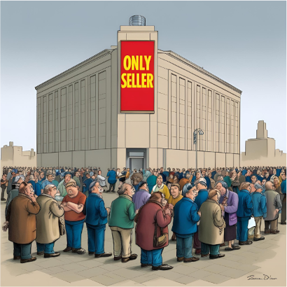

# Monopol

## Was ist ein Monopol?

Ein Monopol ist eine Marktform, bei der es nur **einen einzigen Anbieter** gibt, aber **viele Nachfrager**. Der Anbieter hat die alleinige Kontrolle über das Angebot und kann dadurch oft den Preis bestimmen.

## Merkmale

- Der Monopolist bestimmt meist den Preis und die Menge der Produkte.
- Die Nachfrager haben keine Auswahlmöglichkeit und sind abhängig vom Monopolisten.
- Der Wettbewerb fehlt, weil keine anderen Anbieter vorhanden sind.

## Beispiel

Stell dir vor, es gibt nur eine Firma, die ein bestimmtes Medikament herstellt. Diese Firma kann den Preis festlegen, weil es keine anderen Anbieter gibt.

Ein reales Beispiel, welcher 2015 durch die Medien ging, ist der Fall **Martin Shkreli**: Seine Firma Turing Pharmaceuticals kaufte die Rechte am Medikament *Daraprim*,
das zur Behandlung von Infektionen bei geschwächten Patienten (z. B. mit HIV) eingesetzt wird. Nachdem das Unternehmen das Monopol auf das Medikament hatte,
 erhöhte es den Preis über Nacht von 13,50 $ auf 750 $ pro Tablette. Die Patienten waren auf das Medikament angewiesen und hatten keine Alternative.
 
 
 Mehr zu dem Fall findet man [hier](https://de.wikipedia.org/wiki/Martin_Shkreli) unter der Rubrik *Daraprim*.
 
 

## Warum ist das wichtig?

Das Monopol zeigt, wie Märkte versagen, wenn ein Anbieter allein den Markt bestimmt. Solche Situationen können zu höheren Preisen und weniger Auswahl für die Kunden führen.

---

