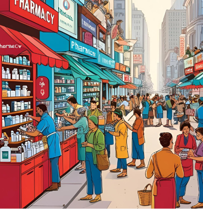

#Polypol / Vollkommener Markt

## Was ist ein Polypol?

Ein **Polypol** ist eine Marktform. **Viele Anbieter** verkaufen das gleiche Produkt. **Viele Käufer** haben eine Nachfrage nach dem Produkt. Kein Verkäufer ist so groß, dass er den Preis bestimmen kann. Die Kunden können frei wählen.

### Beispiel

Stell dir vor, viele Apotheken in einer Stadt verkaufen das gleiche Medikament. Es gibt viele Verkäufer und auch viele Käufer. Keine Apotheke kann den Preis stark verändern, weil die Kund*innen einfach zu einer anderen gehen können.

